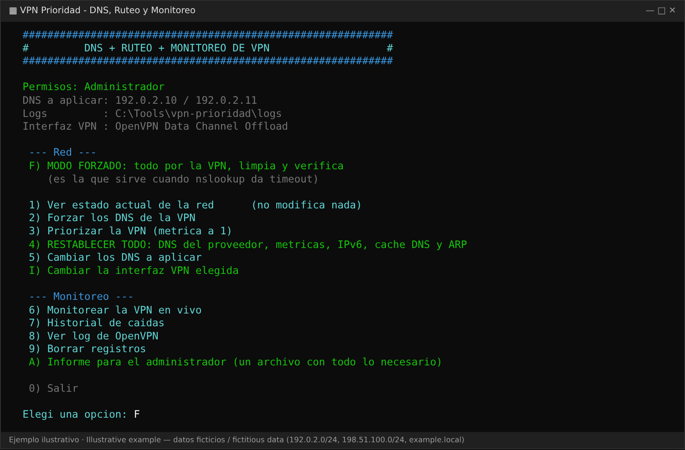
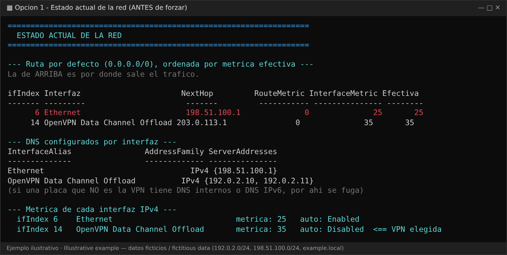
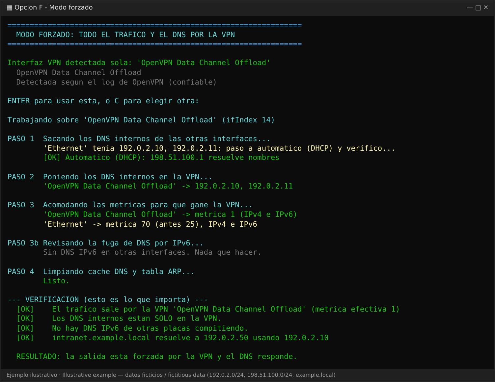
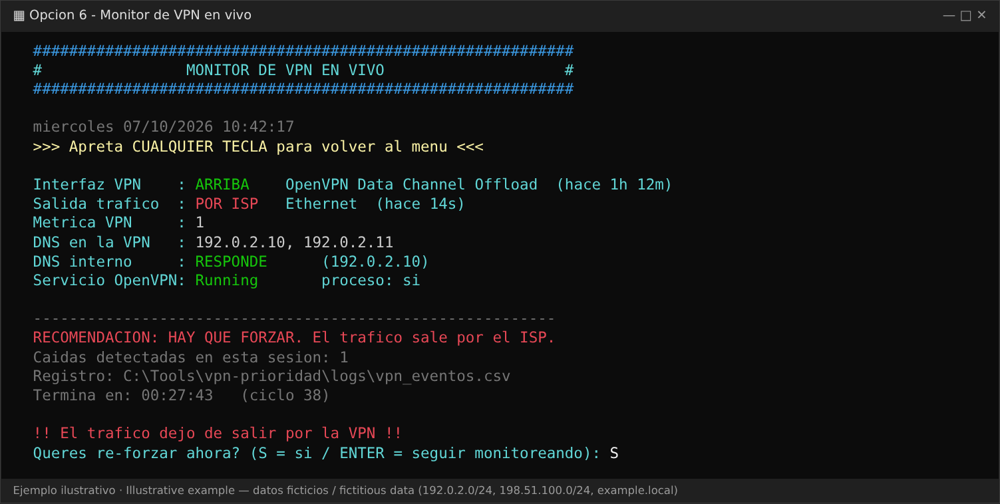
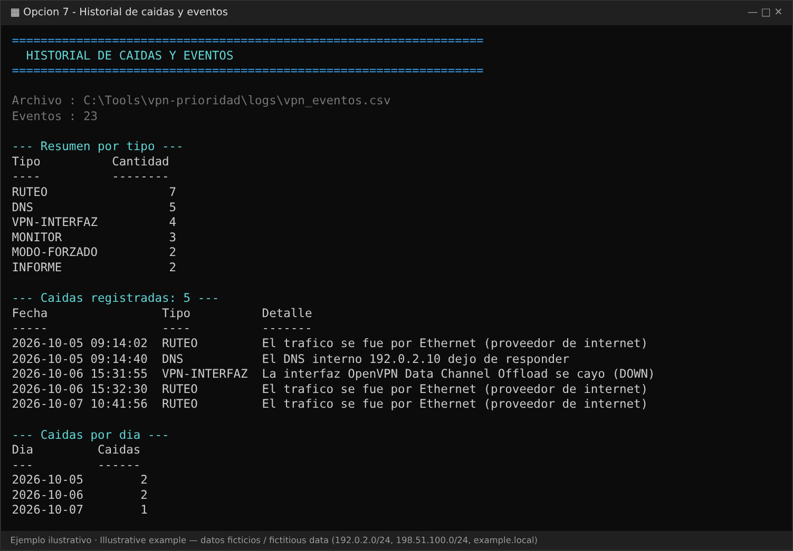

# vpn-prioridad

[English](README.md) · **Español**

Herramienta **todo en uno para Windows** (un solo `.bat`, sin instalar nada) que hace que la VPN tenga prioridad en la **salida de tráfico** y en la **resolución de nombres**, **monitorea** la conexión y deja un **log y un informe** para pasarle al administrador.

> Nació de un problema real: conectado a la VPN, las páginas internas fallaban porque Windows seguía saliendo por la conexión de casa y consultando primero los DNS equivocados. Lo diagnostiqué, lo resolví con ayuda de IA y lo convertí en una herramienta reutilizable.

## El problema

Windows combina los DNS de **todas** las interfaces activas y elige la ruta según la **métrica** de cada una. Si la placa de tu casa tiene la métrica más baja:

1. El tráfico destinado a la VPN sale por tu proveedor de internet.
2. Los nombres internos se consultan a los DNS de tu proveedor, que no los conocen (`nslookup` da timeout o error).

## Cómo funciona

```
 te conectas a la VPN
          │
          ▼
  detecta la placa de la VPN ── (por el log de OpenVPN, o la eliges tú)
          │
          ▼
  1. saca los DNS de la VPN de las demás placas   (vuelven a DHCP, verificado)
  2. pone tus DNS solo en la placa de la VPN
  3. métrica de la VPN → 1   |   demás placas → 70   (IPv4 e IPv6)
  4. revisa la fuga de DNS por IPv6 (opcional: apagar IPv6 durante la sesión)
  5. vacía la caché DNS y la tabla ARP
          │
          ▼
  VERIFICA: ¿el tráfico sale por la VPN?  ¿resuelve el nombre interno?
          │
          ├── OK       → listo
          └── FALLA    → te indica qué revisar, y el monitor sigue vigilando
```

Todo es reversible: la opción **4** restablece DNS, métricas, IPv6 y cachés, y comprueba que no quede ningún DNS de la VPN en otras placas.

## Capturas

> Las capturas son **representaciones ilustrativas con datos ficticios** (rangos de IP de documentación `192.0.2.0/24`, `198.51.100.0/24`, `203.0.113.0/24` y `example.local`). Siguen el formato real de salida de la herramienta.

**Menú principal**



**Opción 1 – el problema:** la placa de casa (`Ethernet`, métrica efectiva 25) le gana a la VPN (35), así que el tráfico sale por el proveedor.



**Opción F – modo forzado:** cinco pasos y una verificación final.



**Opción 6 – monitor en vivo:** detecta el momento en que el tráfico deja de usar la VPN y ofrece forzarlo de nuevo.



**Opción 7 – historial de caídas**



## Inicio rápido

1. Conéctate **primero** a la VPN.
2. Doble clic en `VPN-Prioridad-TodoEnUno.bat` y acepta el aviso de administrador.
3. Opción **5**: carga **los DNS que te dio el administrador** (y, si quieres, un nombre interno que solo resuelva por la VPN, para la verificación final). Quedan guardados en `logs\vpn_config.json`.
4. Elige **F**. Cuando termines de usar la VPN, elige **4** para restablecer todo.

Restablecer sin menú: `VPN-Prioridad-TodoEnUno.bat -Restore`

## Tres formas de ejecutarlo

| Formato | Cómo | Notas |
|---|---|---|
| **`.bat` todo en uno** | Doble clic en `VPN-Prioridad-TodoEnUno.bat` | Pide permisos de administrador solo y saltea la política de ejecución. La opción más fácil. |
| **`.ps1` (PowerShell)** | Desde una PowerShell de administrador: `.\VPN-Prioridad.ps1` | Si PowerShell lo bloquea: `powershell -NoProfile -ExecutionPolicy Bypass -File .\VPN-Prioridad.ps1` (o `Unblock-File .\VPN-Prioridad.ps1` si lo descargaste). |
| **`.exe` (compílalo tú)** | `powershell -NoProfile -ExecutionPolicy Bypass -File .\tools\Build-Exe.ps1` | Genera `dist\VPN-Prioridad.exe`, que pide permisos de administrador al abrirse. Usa [ps2exe](https://github.com/MScholtes/PS2EXE) (se instala solo para tu usuario). |

**Por qué no hay un `.exe` ya hecho en el repo:** un ejecutable sin firma digital suele ser bloqueado por SmartScreen o por el antivirus, y una herramienta que cambia tu configuración de red debe poder leerse completa antes de ejecutarla. Compílalo desde el código fuente.

`VPN-Prioridad.ps1` es la fuente única. El `.bat` se genera a partir de él con `tools\Build-Bat.ps1`: edita el `.ps1` y vuelve a generarlo.

## Menú

| Tecla | Qué hace |
|---|---|
| `F` | **Modo forzado**: todo lo anterior, con verificación |
| `1` | Ver el estado de la red (no modifica nada) |
| `2` | Aplicar los DNS de la VPN (ofrece bajar la métrica si otra placa gana) |
| `3` | Poner solo la métrica de la VPN en 1 |
| `4` | **Restablecer todo** (DNS, métricas, IPv6, caché DNS, ARP) |
| `5` | Cambiar los DNS y el nombre de prueba |
| `I` | Cambiar la interfaz VPN elegida |
| `6` | Monitor en vivo (cada 5 s, con límite de tiempo configurable) |
| `7` | Historial de caídas |
| `8` | Log de OpenVPN: eventos de conexión, reconexión y error |
| `9` | Borrar o archivar registros |
| `A` | **Informe para el administrador** |

## Registros e informe para el administrador

Todo queda en la carpeta `logs\` junto al `.bat`:

| Archivo | Contenido | Ejemplo |
|---|---|---|
| `vpn_eventos.csv` | Eventos con fecha, tipo y severidad (INFO, OK, AVISO, CAIDA, ACCION) | [`examples/vpn_eventos.sample.csv`](examples/vpn_eventos.sample.csv) |
| `vpn_monitor.log` | Lo mismo en texto legible | |
| `informe_admin_*.txt` | Informe: sistema, rutas, métricas, DNS, estado de OpenVPN, resumen de caídas y últimos eventos de OpenVPN | [`examples/informe_admin.sample.txt`](examples/informe_admin.sample.txt) |
| `vpn_config.json` | Tus DNS y el nombre de prueba | [`examples/vpn_config.sample.json`](examples/vpn_config.sample.json) |
| `vpn_dns_state.json` | Estado anterior, para poder restablecer | |

## Privacidad y seguridad

- **El código no trae DNS, dominios ni IPs de nadie**: los pones tú.
- `logs\` está en `.gitignore`. No publiques esos archivos.
- Los registros y el informe incluyen el nombre del equipo, adaptadores, DNS y rutas. Revísalos antes de enviarlos.
- La herramienta cambia DNS y métricas de tu equipo. Si es un equipo de trabajo, consulta antes con tu administrador.

## Requisitos y límites

- Windows 10/11, PowerShell 5.1 (ya viene instalado) y permisos de administrador para aplicar cambios. Sin permisos puedes usar diagnóstico y monitoreo.
- La detección automática de la placa y las funciones de log están pensadas para **OpenVPN**. Con otra VPN, elige la placa a mano (`I`).
- Pensada para **túnel completo** (la VPN lleva la ruta por defecto). Con túnel dividido (split tunneling), la verificación "el tráfico sale por la VPN" informará una falla aunque todo funcione.
- Apagar IPv6 reinicia la placa un instante (la conexión se corta un momento). La opción `4` lo vuelve a prender.

## Si la verificación falla

1. La interfaz elegida no es la VPN → opción `I` y revisa su gateway.
2. El túnel se cayó → opción `1` y mira si OpenVPN sigue `Running`.
3. El DNS interno cambió → opción `5`.

## Cómo trabajé con IA

1. Describí el síntoma y pegué la salida de los comandos de diagnóstico (`Get-NetRoute`, `Get-DnsClientServerAddress`, `Resolve-DnsName`), sin datos sensibles.
2. Pedí la causa probable y cómo confirmarla.
3. Convertí cada comando suelto en una opción de un menú, con verificación y rollback.
4. Agregué monitoreo y registros para poder explicarle el problema al administrador con datos.

El resultado: algo que me hacía perder tiempo en cada conexión se resuelve con un clic.

## Estructura del proyecto

```
VPN-Prioridad.ps1               la herramienta (PowerShell)
VPN-Prioridad-TodoEnUno.bat     la misma herramienta con lanzador de doble clic (generado)
tools/Build-Bat.ps1             regenera el .bat a partir del .ps1
tools/Build-Exe.ps1             compila el .ps1 a .exe (ps2exe)
tools/bat-header.txt            la parte lanzadora del .bat (auto-elevación)
docs/img/                       capturas
examples/                       ejemplos de configuración, log de eventos e informe para el administrador
```

## Licencia

[MIT](LICENSE) © 2026 AlbertiJ. Libre para usar, modificar y compartir. Se entrega tal cual, sin garantía: cambia la configuración de red, así que úsala bajo tu responsabilidad.
